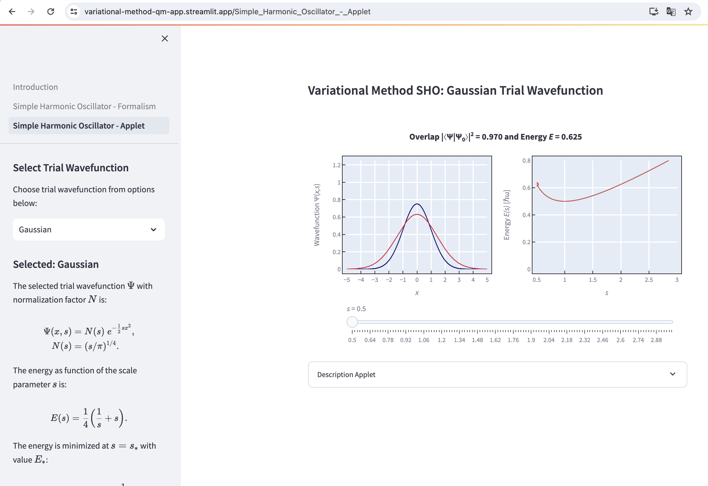

# varational-method-QM-app
A streamlit app that visualizes the variational method in quantum mechanics in the context of the simple harmonic oscillator. The app can be found [here](https://variational-method-qm-app.streamlit.app/) and is part of a larger [database](https://physicsdemos.web.rug.nl/digital-demos/quantum-physics-dd/variational-method-in-quantum-mechanics/) of physics simulations and animations (aka [Digital Demos](https://physicsdemos.web.rug.nl/digital-demos/)). 

